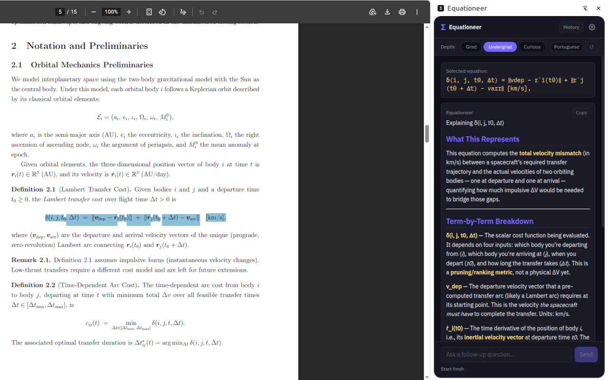
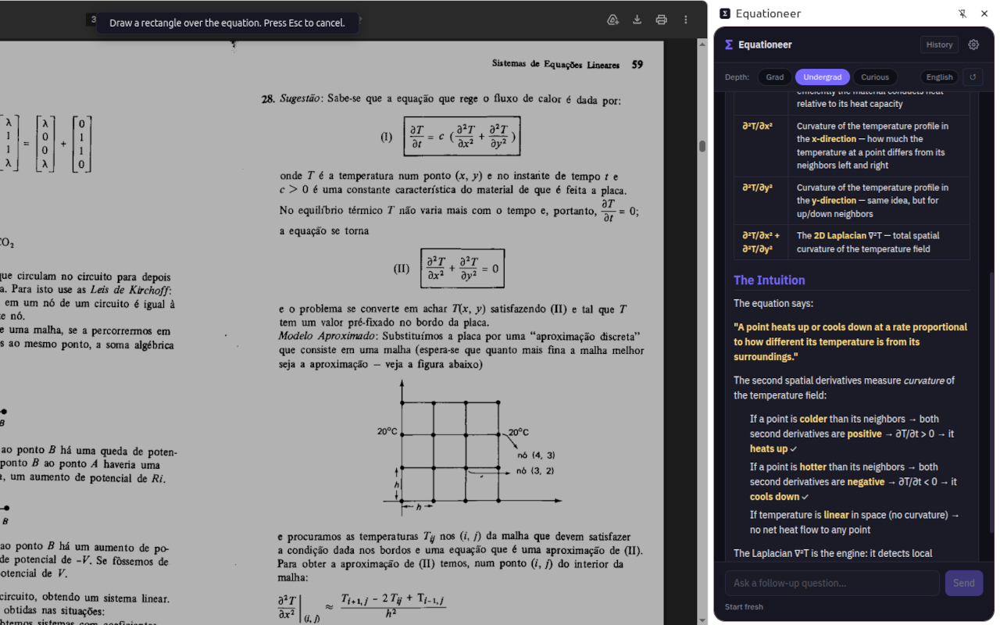
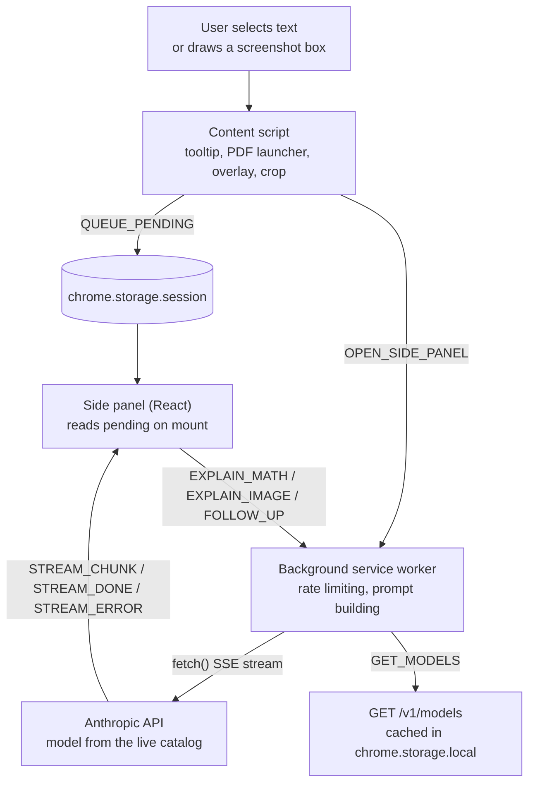

# Equationeer

A Chrome extension that turns any highlighted math equation into a deep, intuitive explanation powered by Claude AI — without leaving the page you're reading.





## Features

- **Quiet by default**: active everywhere, but the floating `Σ Explain` pill only appears on PDFs, so an ordinary page looks untouched
- **Highlight-to-Explain**: select any equation on a web page and click the floating `Σ Explain` pill
- **Screenshot Mode** — draw a rectangle over image-rendered math (PDFs, slides) and explain it via Claude Vision
- **Three depth levels**: Grad / Undergrad / Curious, switchable per explanation with ↺ re-explain. Each level is an enforced output contract, checked by an eval, not just a hint in the prompt
- **Streaming output** — tokens appear as Claude generates them, no waiting for the full response
- **LaTeX rendering** — KaTeX renders math in explanations, follow-up answers, and the equation preview
- **Follow-up chat** — ask clarifying questions scoped to the current equation
- **History** — every explanation is saved locally (IndexedDB) with depth and language metadata; export as JSON or Markdown
- **Multi-language responses** — configure Claude to respond in 10+ languages; the active language is always shown in the side panel
- **Document context** — for HTML pages, the page text is included alongside the equation for richer, context-aware explanations
- **Live model list**: models are read from the Anthropic Models API with your key, so a newly released model appears in Settings without updating the extension
- **Configurable response length**: 512 to 2048 tokens (default 1024), or "Max" (the model's limit, capped at 16,000). This is the *answer* budget: thinking-capable models get extra headroom on top, and a truncated answer says so
- **Dark / Light / System theme**

## Installation

### From source

```bash
git clone <repo>
cd equationeer
npm install
npm run build       # outputs to dist/
```

1. Open `chrome://extensions`
2. Enable **Developer mode** (top-right toggle)
3. Click **Load unpacked** → select the `dist/` folder
4. The Equationeer icon appears in the toolbar

> **First launch:** the Settings page opens automatically. Enter your Anthropic API key and click Validate.

### Allow access to local PDFs (optional)

On `chrome://extensions`, click **Details** under Equationeer → enable **Allow access to file URLs**.

> Note: in Chrome's PDF viewer, use the **Σ Explain** button in the bottom-right corner (it starts Screenshot Mode), or right-click a text selection. See [PDFs](#pdfs) for why the hover pill cannot work there.

## Getting an API key

1. Go to <https://console.anthropic.com/settings/keys>
2. Create a new key
3. Paste it into Equationeer Settings → validate → save

Your key is stored in `chrome.storage.local` (encrypted at rest by Chrome) and is only ever sent to `api.anthropic.com`.

## Usage

### Text selection

1. Select any math on a web page
2. Click the **Σ Explain** pill that appears above the selection

The pill needs the hover setting to include the page (see [Where Equationeer runs](#where-equationeer-runs)). Anywhere Equationeer is active you can also right-click a selection and choose **Explain with Equationeer**, which is the text path inside Chrome's PDF viewer.

### PDFs

Chrome renders PDFs inside a frame owned by its own built-in viewer extension
(`chrome-extension://mhjfbmdgcfjbbpaeojofohoefgiehjai`). No extension can inject a content script
there, and neither text selection nor mouse events reach the page Equationeer *can* reach, so a
pill that follows your selection is not possible on those pages. Verified: the top-level document
of a PDF tab reports `application/pdf`, has an empty body, and never receives `mouseup` or
`selectionchange`.

Equationeer handles PDFs two ways instead, both of which work over the viewer:

- **Σ Explain button**, bottom-right of the PDF. One click starts Screenshot Mode; draw a box over
  the equation. This is the main path, and it works for equations rendered as images.
- **Right-click a text selection** → *Explain with Equationeer*. Chrome hands the selected text to
  the extension even though the page cannot read it.

A PDF shown through a site's own PDF.js viewer is ordinary DOM, so it keeps the normal hover pill.

### Screenshot Mode (image-based equations)

Use this for equations rendered as images — e.g. image-based PDFs, scanned papers, or slides.

1. **Open the PDF or page in Chrome** (the screenshot captures the current tab)
2. Click the Equationeer icon in the toolbar → **Screenshot Mode**
3. Drag a rectangle over the equation
4. Release — the cropped image is sent to Claude Vision; the explanation streams into the side panel
5. Press **Esc** to cancel without capturing

## Where Equationeer runs

Two separate settings, both defaulting to PDFs only, under Settings → **Where Equationeer Runs**.

**Active on**: whether Equationeer attaches to a page at all. When it is off for a page, there is no
selection listener, no screenshot overlay, and no context-menu entry; the page behaves exactly as if
the extension were not installed.

| Option | Behavior |
|---|---|
| `PDFs only` | PDFs in Chrome's viewer, `.pdf` URLs, `file://` PDFs and embedded PDF.js viewers |
| `PDFs + chosen sites` | The above, plus hostnames on your allowlist (subdomains included) |
| `All pages` (default) | Everywhere |

**Hover "Σ Explain" button**: whether the floating pill appears on selection. `PDFs only` (default),
`Everywhere active`, or `Never` (use the right-click menu instead). The pill never appears on a page
Equationeer is not active on, so this setting can only narrow the first one. On Chrome's PDF viewer
this setting controls the corner button described under [PDFs](#pdfs), since a selection-following
pill is impossible there.

The toolbar popup shows the current page's status and has a one-click **Turn on for this site**,
which adds the hostname to the allowlist. Changing either setting takes effect immediately, with no
page reload.

> The content script is still declared for `<all_urls>` in the manifest, because a PDF cannot be
> recognized from its URL alone (arxiv.org/pdf/2401.12345 has no `.pdf` extension, and the content
> type is only visible from inside the page). What the scope settings control is whether that script
> attaches anything: outside its scope it registers no listeners and injects no UI.

## Models

The model list is not compiled into the extension. On first use, and at most once a day after that,
the background service worker calls `GET https://api.anthropic.com/v1/models` with your key, caches
the result in `chrome.storage.local`, and renders Settings from that cache. A model released after
your installed build appears in the list on its own; **Refresh list** forces the call immediately.

- The bundled list in [`src/utils/models.ts`](src/utils/models.ts) is a cold-start fallback only,
  used before the first successful fetch or when the call fails.
- A model that is retired while selected falls back to `claude-opus-5`, with a note in Settings.
- Per-model output limits and image support come from the same response, so Screenshot Mode reports
  a clear error rather than an API 400 when a text-only model is selected.
- API key validation also uses `GET /v1/models`: it costs no tokens and names no model, so it cannot
  break when a model is retired.
- Prices are deliberately not shown, since the API does not report them and a hardcoded table would
  be the exact thing this design avoids. See <https://console.anthropic.com> for current pricing.

### Thinking and the token budget

Current models think before answering, and thinking is spent from the same `max_tokens` allowance as
the answer. Left alone, Claude Opus 5 will spend a small budget entirely on reasoning and stream no
answer at all: measured 1023 of 1024 output tokens on a single equation, with `stop_reason:
max_tokens` and zero visible text. Equationeer handles this in three places:

- **Response Length is the answer budget.** `THINKING_HEADROOM_TOKENS` (1024) is added on top for
  models whose catalog entry reports adaptive thinking.
- **The budget is stated in the prompt, not just enforced.** `max_tokens` is a ceiling the model
  cannot see, so left alone it plans a full explanation and gets guillotined mid-sentence. The
  prompt carries a `<length_budget>` in words, derived from the token setting at a measured ~2.65
  output tokens per word for math-heavy markdown (roughly double plain prose). At the 1024 default
  that is a 341-word target, which finishes all six sections and stops with `end_turn`. Budgets
  above ~4,000 tokens get no instruction, since an unconstrained explanation measured ~3,300 tokens
  and already fits.
- **`output_config.effort` is set to `low`** for explanation requests, which keeps reasoning short on
  a task that is one short answer streamed while you wait. It is sent only when the catalog says the
  model supports it, because Haiku 4.5 rejects the parameter with a 400.
- **Silence is reported.** An empty response, a mid-stream `error` event (which arrives with HTTP
  200, not an error status), and a `max_tokens` cut-off each produce a message instead of a blank
  panel. A truncated answer is marked as truncated.

Every request now ends in exactly one terminal message. `streamExplanation` has seven exits and all
of them emit either `STREAM_DONE` with non-empty text or `STREAM_ERROR` with a reason: network
failure, idle timeout, non-2xx status, missing body, mid-stream error event, empty output, or a
completed answer. A 60-second inactivity watchdog covers a stalled connection, which is what used to
produce a spinner that never resolved, and it keeps the request inside the MV3 service worker's
lifetime.

The one gap left is outside the extension's reach: if Chrome tears down the service worker
mid-request (a crash, or reloading the extension while a stream is open), no message is ever sent
and the panel keeps waiting. Closing that would need a watchdog in the side panel itself.

## Architecture



Content scripts never call the Anthropic API. Every request goes through the service worker, which
is the only place the API key is read.

**Why session storage?** The side panel takes a moment to mount and register its message listeners. If the background broadcast stream events before the panel was ready, they would be lost. Storing the request in `chrome.storage.session` and having the side panel read it on mount guarantees the panel is ready before the first API call starts.

## Depth levels

`grad`, `undergrad` and `curious` shift vocabulary and assumed background. They never remove a
section: all six headings appear at every level, because the side panel renders against them.

Each level is an output contract in [`promptBuilder.ts`](src/utils/promptBuilder.ts) that constrains
vocabulary, sentence length and notation, plus a one-line reminder repeated at the end of the prompt
where recency helps most. A one-line audience description was not enough on its own: the six section
headings and "be precise, never be vague" both pull toward technical prose, so all three levels came
out at roughly the same reading grade.

Measured on two equations, before and after the contracts (Flesch-Kincaid grade, lower is easier):

| Level | Before | After |
|---|---|---|
| `grad` | 12.0 / 13.1 | 13.0 / 13.3 |
| `undergrad` | 10.2 / 12.0 | 10.8 / 9.8 |
| `curious` | 10.7 / 10.4 | 5.7 / 5.3 |

Before, ELI-Curious read *harder* than ELI-Undergrad on one case and carried the same share of
complex words as ELI-Grad. It now lands in the general-audience band.

### Checking it stays that way

```sh
ANTHROPIC_API_KEY=sk-ant-... npm run eval:depth
```

[`tests/eval/depth.eval.ts`](tests/eval/depth.eval.ts) generates explanations at all three levels and
asserts that reading difficulty decreases with level, that ELI-Curious stays within the
general-audience band (grade ≤ 8, fog ≤ 10, sentences ≤ 15 words, complex words ≤ 13%), that ELI-Grad
stays technical, and that all six sections survive at every level. Metrics are computed by
[`tools/readability.ts`](tools/readability.ts), which has its own unit tests.

This is deliberately **not** part of `npm test`: it calls the real API and costs money. It skips
when no key is set. Reverting the curious contract to its old one-line form makes it fail with
`curious should read easier than undergrad: expected 11.1 to be less than 10.8`, which is the
regression it exists to catch.

## Development

```bash
npm run dev     # Vite dev server with @crxjs/vite-plugin HMR
npm run build   # Production build → dist/
```

### Debugging each context

| Context | How to open DevTools | Log prefix |
|---|---|---|
| Service worker | `chrome://extensions` → "service worker" link | `[EQ:SW]` |
| Side panel | Right-click inside panel → Inspect | `[EQ:SP]` |
| Content script | DevTools on the target page → Console | `[EQ:content]` |
| Popup / Options | Right-click the page → Inspect | — |

## Troubleshooting

**Loading spinner that never resolves**
- Open the service worker DevTools (see above) and check the console for `[EQ:SW]` errors
- Most common cause: API key not set — open Settings and add your Anthropic key
- Second cause: the extension was reloaded without rebuilding — run `npm run build` and reload

**Tooltip doesn't appear**
- By default the hover pill is limited to PDFs. Open the toolbar popup: it says whether Equationeer
  is active on the current page, and offers **Turn on for this site**. Settings → Where Equationeer
  Runs has the full controls.
- Refresh the page — content scripts are injected on page load, not on extension reload
- Some pages block content scripts (Chrome internal pages, Web Store, etc.)

**Equations in a PDF aren't explained**
- Use the **Σ Explain** button in the bottom-right corner of the PDF, then draw a box over the equation. The hover pill cannot work inside Chrome's PDF viewer; see [PDFs](#pdfs).
- For text, right-click the selection → **Explain with Equationeer**.
- No corner button? The hover setting must include PDFs (it does by default), and the page needs a reload after changing Chrome's extension permissions.
- For local (`file://`) PDFs: ensure "Allow access to file URLs" is enabled under the extension Details page in `chrome://extensions`.

**"API 400" error in the panel**
- Usually a wrong or revoked API key — re-validate in Settings
- If it started after switching models, hit **Refresh list** in Settings: the selected model may have
  been retired

**Rate limit warning**
- The extension caps requests at 30 per minute with a 500 ms debounce. Wait and retry.

## Upgrading from 1.0.0

Chrome pushes extension updates silently. An existing install keeps everything in
`chrome.storage.local` and IndexedDB, so the upgrade is designed to be a no-op for anyone already
using it. [`tests/utils/upgrade.test.ts`](tests/utils/upgrade.test.ts) pins this against the exact
1.0.0 stored shape.

What carries over untouched: API key, depth, theme, language, selected model, response length, and
the full explanation history. The IndexedDB schema is unchanged at version 1.

What is filled in: the three scope keys did not exist in 1.0.0, so `chrome.storage.local.get(defaults)`
supplies them. Existing users get `siteActivation: "all"` and `tooltipScope: "pdf"`, which is the
behavior they already had on web pages, plus the PDF button.

Defaults apply to new installs only. A 1.0.0 user who had Response Length at 1500 keeps 1500; the new
1024 default does not overwrite it. Likewise a stored model: all three IDs 1.0.0 could store
(`claude-haiku-4-5-20251001`, `claude-sonnet-4-6`, `claude-opus-4-7`) are in the bundled fallback
list, so they resolve on the first launch before any catalog fetch, with no silent model switch.

**No new permissions.** The permission set is identical to 1.0.0, which matters: widening permissions
makes Chrome disable an extension until the user re-approves it. A test asserts the exact set so a
future change cannot widen it by accident.

One unavoidable rough edge, standard for any Chrome extension update: tabs that were already open
hold a content script from the old version, which Chrome disconnects on update. In those tabs the
hover pill stops working until the tab is reloaded. Right-click → **Explain with Equationeer** still
works there, because that path runs in the service worker and injects fresh, so the context menu is
deliberately shown unless a content script reports the page is out of scope.

Before publishing, rebuild and repackage: `npm run build`, then zip `dist/`.

## Contributing

```sh
npm install
npm run dev          # Vite dev server with @crxjs/vite-plugin HMR
```

Before opening a pull request:

```sh
npm run lint
npm run typecheck
npm test             # unit + integration, no API key needed
npm run build        # the minimum quality gate
```

Conventions this repo holds to:

- TypeScript everywhere, no plain JS, and no `any` in Chrome message or API payload types.
- New code ships with tests in the same commit. Coverage on `src/utils` is gated at 90%.
- A bug fix adds the test that would have caught it.
- Changing behavior means updating the README in the same commit. Docs describe what is, and mark
  anything unbuilt as such.
- Touching the explanation output, depth levels or the prompt means running
  `npm run eval:depth` as well, since the unit tests cannot see prose quality.

## Privacy

See [PRIVACY.md](PRIVACY.md). No data leaves your device except for the selected text / image sent to the Anthropic API using your own key. No telemetry, no analytics.
